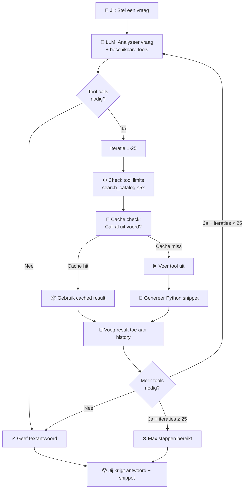
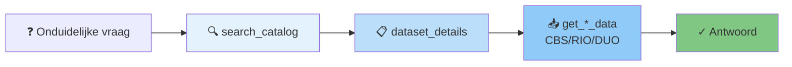
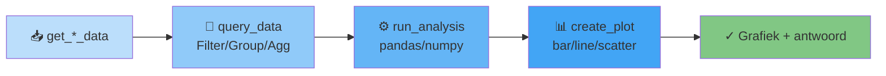
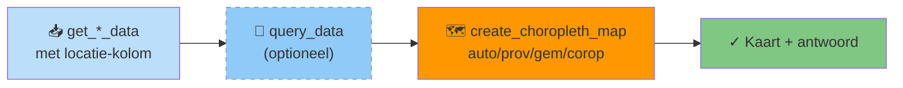
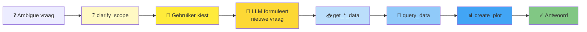
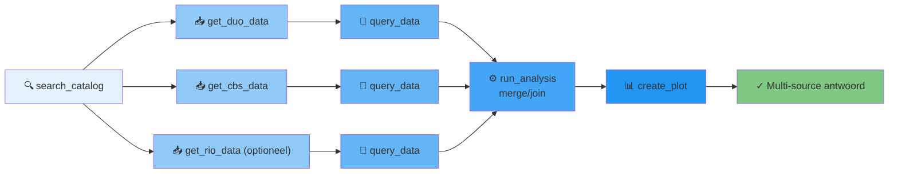

# Tools

De assistent beschikt over de volgende tools. Ze worden automatisch ingezet op basis van je vraag — je hoeft ze niet expliciet aan te roepen.

Bij elke tool-aanroep wordt een reproduceerbaar Python-snippet getoond in de chat, zodat je de analyse lokaal kunt herhalen.

## Hoe tool calling werkt

De assistent volgt een **agentic loop**:

1. **Je stelt een vraag** → Vraag wordt naar het LLM gestuurd met beschikbare tool-schema's
2. **LLM beslist** → Kiest welke tools nodig zijn met parameters
3. **Tools worden uitgevoerd** → Synchroon, in parallel wanneer mogelijk
4. **Resultaten teruggevoerd** → LLM ziet output en beslist of meer tools nodig zijn
5. **Loop** → Stappen 2-4 herhalen totdat LLM alleen tekst antwoordt (geen tool calls meer)

**Beperkingen per turn:**
- Maximaal 25 iteraties (stap 2-4, configureerbaar via `MAX_TOOL_ITERATIONS`)
- `search_catalog` max 5x per vraag
- Tool-resultaten begrensd op 12.000 karakters

**Caching:** Als dezelfde tool met identieke parameters tweemaal wordt aangeroepen, geeft het systeem het eerder gecachde resultaat terug (geen dubbele query).

### Flowchart

---

## Tool Calling Patterns

Aanbevolen tool-sequenties (chains) voor verschillende soorten vragen. Het LLM kiest idealiter deze volgorde:

### Pattern 1: Data Verkenning (Discovery)

**Gebruik:** Onbekende vraag, weten niet welke data beschikbaar is.

**Ideale volgorde:**
1. `search_catalog` — Zoek relevante datasets
2. `dataset_details` — Inspecteer beschikbare kolommen en filters
3. `get_*_data` — Haal de geselecteerde data op

**Voorbeeld:** "Hoeveel MBO-instellingen zijn er in Utrecht?"
- search_catalog → "MBO instellingen" → RIO-dataset gevonden
- dataset_details → RIO-dataset → organisatorischeEenheidcode, plaats, etc.
- get_rio_data → Filter op plaats='Utrecht' en soort=MBO

#### Flowchart

---

### Pattern 2: Analyse met Visualisatie

**Gebruik:** Data beschikbaar, nu analyseren en visualiseren.

**Ideale volgorde:**
1. `get_*_data` — Laad volledige dataset
2. `query_data` — Filter, groepeer, aggregeer indien nodig
3. `run_analysis` — Voer berekeningen, transformaties uit (pandas/numpy)
4. `create_plot` — Maak interactieve grafiek

**Voorbeeld:** "Toon MBO-inschrijvingen per jaar als line chart"
- get_duo_data → studentprognoses-mbo
- query_data → Group by Jaar, sum Aantal
- run_analysis → (optioneel: extra berekeningen)
- create_plot → line chart

#### Flowchart

---

### Pattern 3: Geografische Analyse

**Gebruik:** Geografische vraag, visualiseer op kaart van Nederland.

**Ideale volgorde:**
1. `get_*_data` — Laad data met locatie-kolom
2. `query_data` — (Optioneel) filter indien nodig
3. `create_choropleth_map` — Maak provincie/gemeente/COROP kaart

**Voorbeeld:** "MBO-inschrijvingen per provincie als kaart"
- get_rio_data → MBO-instellingen per provincie
- create_choropleth_map → niveau="provincie"

#### Flowchart

---

### Pattern 4: Scopeverduidelijking + Analyse

**Gebruik:** Vraag is ambigue, eerst verduidelijken dan analyseren.

**Ideale volgorde:**
1. `clarify_scope` — Toon keuzes aan gebruiker
2. (Wacht op keuze) — Gebruiker selecteert optie
3. (LLM formuleert nieuwe vraag met context)
4. `get_*_data` → `query_data` → `create_plot` — Analyseer met gekozen scope

**Voorbeeld:** "Hoeveel studenten in MBO?"
- clarify_scope → "Bedoel je ingeschrevenen, afgestudeerden, of dropout?"
- Gebruiker kiest "ingeschrevenen"
- get_duo_data → query_data → create_plot

#### Flowchart

---

### Pattern 5: Complexe Analyse (Multi-Source)

**Gebruik:** Combineer data uit meerdere bronnen, voer geavanceerde analyses uit.

**Ideale volgorde:**
1. `search_catalog` — Vind relevante datasets
2. `get_cbs_data` + `get_duo_data` + `get_rio_data` — Laad meerdere datasets (parallel)
3. `query_data` — Filter en selecteer kolommen per dataset
4. `run_analysis` — Voer pandas join/merge uit op meerdere datasets
5. `create_plot` — Visualiseer gekombineerde analyse

**Voorbeeld:** "Vergelijk MBO-inschrijvingen (DUO) met bevolking (CBS) per regio"
- search_catalog → Vind beide datasets
- get_duo_data + get_cbs_data (parallel)
- run_analysis → Merge op regio
- create_plot → Duo-axis chart

#### Flowchart

---

## Keuzes die het LLM maakt

Bij elke vraag bepaalt het LLM automatisch:

| Beslissing | Criterium |
|-----------|-----------|
| **search_catalog nodig?** | Vraag noemt geen specifieke dataset |
| **dataset_details nodig?** | Onzeker over beschikbare filters/dimensies |
| **query_data nodig?** | Data moet gefilterd, gegroepeerd of geclusterd |
| **run_analysis nodig?** | Complexe berekeningen, transformaties, joins |
| **Visualisatie nodig?** | Vraag vraagt om grafiek/kaart, OF data is complex |
| **clarify_scope nodig?** | Vraag heeft meerdere geldige interpretaties |

Het LLM springt stappen over als ze niet nodig zijn. Dit heet **"lazy evaluation"** — efficiënter en sneller.

## search_catalog

Doorzoekt de gecombineerde catalogus van CBS, RIO en DUO.

| Parameter | Type | Beschrijving |
|-----------|------|-------------|
| `query` | string | Zoekterm, bijv. `"mbo studenten prognose"` |
| `source` | string | `"cbs"`, `"rio"`, `"duo"` of `"both"` (standaard: alles) |
| `top_n` | integer | Maximaal aantal resultaten (standaard: 15) |
| `geo_niveau` | string | Filter op geografisch niveau (optioneel) |

**Gebruik:** Als startpunt bij onduidelijke vragen of om te verkennen welke datasets beschikbaar zijn.

**Let op:** Deze tool is beperkt tot **5 aanroepen per vraag** om oneindige zoeklussen te voorkomen.

---

## dataset_details

Haalt metagegevens van een specifieke dataset op (kolommen, dimensies, beschrijving).

| Parameter | Type | Beschrijving |
|-----------|------|-------------|
| `dataset_id` | string | Dataset-ID, bijv. `"85423NED"` (CBS) of `"studentprognoses-mbo-v1"` (DUO) |

**Gebruik:** Verken beschikbare dimensies/filters voordat je data ophaalt.

---

## get_cbs_data

Haalt rijen op uit een CBS-dataset via de OData API.

| Parameter | Type | Beschrijving |
|-----------|------|-------------|
| `dataset_id` | string | CBS dataset-ID, bijv. `"85423NED"` |
| `filters` | object | OData-parameters, bijv. `{"$filter": "Geslacht eq 'T001038'"}` |

---

## get_cbs_dimension

Haalt de mogelijke waarden op van een dimensie in een CBS-dataset. Handig om te zien welke filterwaarden beschikbaar zijn.

| Parameter | Type | Beschrijving |
|-----------|------|-------------|
| `dataset_id` | string | CBS dataset-ID |
| `dimension_name` | string | Naam van de dimensie, bijv. `"Geslacht"` |

---

## get_rio_data

Haalt records op uit het RIO-register.

| Parameter | Type | Beschrijving |
|-----------|------|-------------|
| `resource` | string | Resource naam, bijv. `"onderwijslocaties"` |
| `filters` | object | Filterparameters, bijv. `{"organisatorischeEenheidcode": "25LH"}` |

Zie [Databronnen → RIO](databronnen.md) voor beschikbare resources.

---

## get_duo_data

Laadt een DUO open dataset. Retourneert kolomschema, voorbeeldwaarden en een `data_key` voor vervolgquery's.

| Parameter | Type | Beschrijving |
|-----------|------|-------------|
| `dataset_id` | string | CKAN package-naam, bijv. `"studentprognoses-mbo-v1"` |
| `resource` | integer \| string | Index of naam-substring van het bestand binnen de dataset (standaard: 0) |

!!! note
    De geladen data wordt gecached in de sessie. Roep `get_duo_data` eenmalig aan per dataset en gebruik daarna `query_data` voor gefilterde analyses.

---

## query_data

Filtert, groepeert en aggregeert rijen uit gecachede data. Werkt voor alle databronnen na het ophalen (CBS, RIO, DUO) en voor resultaten van `run_analysis`.

| Parameter | Type | Beschrijving |
|-----------|------|-------------|
| `data_key` | string | Sleutel uit een eerdere tool-aanroep, bijv. `duo:123:0`, `cbs:85423NED` |
| `filters` | object | Kolomfilters met operators: `{"Jaar": {"gte": "2020"}}`, of exact: `{"Leerweg": "Voltijd"}` |
| `columns` | array | Alleen deze kolommen teruggeven |
| `max_rows` | integer | Maximaal aantal rijen (standaard: 500) |
| `group_by` | array | Groeperen op deze kolommen |
| `aggregate` | object | Aggregatiefuncties per kolom, bijv. `{"Aantal": "sum"}` |

---

## run_analysis

Voert pandas/numpy-code uit in een beveiligde sandbox op eerder opgehaalde data.

| Parameter | Type | Beschrijving |
|-----------|------|-------------|
| `code` | string | Python-code (pandas, numpy, plotly express beschikbaar) |
| `data_key` | string | Optionele data_key — het bijbehorende DataFrame is beschikbaar als `df` |

De sandbox blokkeert imports, `exec`, `eval`, `os`, `sys` en andere onveilige operaties. Beschikbare namen: `pd`, `np`, `math`, `px`, `go`.

---

## create_plot

Maakt een interactieve Plotly-grafiek.

| Parameter | Type | Beschrijving |
|-----------|------|-------------|
| `chart_type` | string | `"bar"`, `"line"`, `"scatter"`, `"pie"` of `"histogram"` |
| `x` | string | Veldnaam voor de x-as (of labels bij pie) |
| `y` | string | Veldnaam voor de y-as (of waarden bij pie) |
| `title` | string | Titel van de grafiek |
| `data_key` | string | Data_key van eerder opgehaalde data (optioneel, alternatief voor `data`) |
| `data` | array | Lijst van datarijen als objecten (optioneel, alternatief voor `data_key`) |
| `color_by` | string | Veldnaam voor groepering (optioneel) |

De grafiek wordt direct in de chat weergegeven.

---

## create_choropleth_map

Maakt een choropleth-kaart van Nederland op provincie-, gemeente- of COROP-niveau.

| Parameter | Type | Beschrijving |
|-----------|------|-------------|
| `location_col` | string | Kolomnaam met locatienamen |
| `value_col` | string | Kolomnaam met waarden |
| `title` | string | Titel van de kaart |
| `data_key` | string | Data_key van eerder opgehaalde data (optioneel) |
| `data` | array | Lijst van datarijen als objecten (optioneel) |
| `level` | string | `"auto"`, `"provincie"`, `"gemeente"` of `"corop"` (standaard: auto) |

---

## clarify_scope

Stelt een verduidelijkingsvraag aan de gebruiker wanneer de oorspronkelijke vraag meerdere interpretaties heeft.

| Parameter | Type | Beschrijving |
|-----------|------|-------------|
| `vraag` | string | De verduidelijkingsvraag |
| `opties` | array | 2-3 keuzes met `label`, `beschrijving` en `aanbevolen` (boolean) |

**Gebruik:** Wanneer ambiguïteit voorkomen kan worden. Onderbreekt de normal flow: je selecteert een optie, dan gaat het LLM een nieuwe vraag formuleren met jouw keuze.

Deze tool wordt afgehandeld door de UI — de gebruiker ziet een keuzemenu en kan een optie selecteren.
